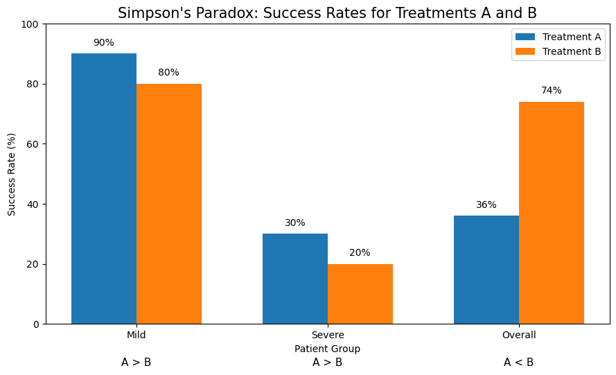

## Abstract

Simpson's Paradox is a statistical phenomenon in which a relationship observed within separate groups can change or even reverse when the groups are combined. This blog explains the intuition behind the paradox using a simple example of two medical treatments. The example shows how differences in the composition of groups can cause aggregate data to tell a very different story from the data within individual groups.

## Introduction

When we look at data, we often expect the numbers to give us a clear answer. If Treatment A has a higher success rate than Treatment B for different groups of patients, it seems reasonable to conclude that Treatment A is better. However, this conclusion can change when we combine the groups together.

This surprising situation is called **Simpson's Paradox**. Simpson's Paradox occurs when a relationship appears in several separate groups but changes or even reverses when the groups are combined. The mathematics behind it is not necessarily difficult. What makes the paradox unintuitive is that the way we group the data can change the conclusion we draw from it.

## A Simple Example

Suppose a hospital is comparing two treatments, Treatment A and Treatment B. Patients can be divided into two groups: mild cases and severe cases.

For mild cases, suppose Treatment A has a success rate of $90%$, while Treatment B has a success rate of $80%$. Therefore, Treatment A performs better:

$$
90\% > 80\%.
$$

For severe cases, suppose Treatment A has a success rate of $30%$, while Treatment B has a success rate of $20%$. Again, Treatment A performs better:

$$
30\% > 20\%.
$$

At this point, it seems obvious that Treatment A is the better treatment.

However, suppose the number of patients receiving each treatment is very different. Treatment A is used mostly for severe cases, while Treatment B is used mostly for mild cases.

For Treatment A, suppose there are 100 mild cases and 900 severe cases. Its overall success rate is

$$
\frac{100(0.90)+900(0.30)}{1000}
=0.36
=36\%.
$$

For Treatment B, suppose there are 900 mild cases and 100 severe cases. Its overall success rate is

$$
\frac{900(0.80)+100(0.20)}{1000}
=0.74
=74\%.
$$

Now we get a surprising result. Treatment A performs better in both patient groups, but Treatment B has the higher overall success rate:

$$
36\% < 74\%.
$$

This is the key feature of Simpson's Paradox.

## Why Does This Happen?

The key is that the two treatments have different proportions of mild and severe patients.

Mild patients are easier to treat, so having more mild patients naturally increases a treatment's overall success rate. Treatment B has mostly mild patients, while Treatment A has mostly severe patients.

Therefore, the overall success rates are not simply comparing the quality of the two treatments. They are also reflecting the different compositions of the patient groups.

In other words, the overall success rate is a weighted average of the success rates in the different groups. The weights are determined by how many patients belong to each group.

For Treatment A, the calculation is

$$
0.10(90\%) + 0.90(30\%) = 36\%.
$$

For Treatment B, the calculation is

$$
0.90(80\%) + 0.10(20\%) = 74\%.
$$

These calculations show why the overall comparison can be different from the comparisons within each group.

This is the main intuition behind Simpson's Paradox: an aggregate result can hide what is happening inside individual groups.

## Visualizing the Paradox

We can visualize the success rates of the two treatments. Figure @fig-success-rates shows the success rates for mild cases, severe cases, and the overall population.

{#fig-success-rates width=85%}

The figure shows the paradox clearly. Within both the mild and severe groups, Treatment A has a higher success rate than Treatment B. However, when we look at the overall data, Treatment B has a much higher success rate.

## Why Should We Care?

Simpson's Paradox is important because aggregate statistics are common in economics, business, medicine, and many other fields. Looking only at an overall average can sometimes lead to a misleading conclusion.

For example, when comparing two policies, companies, schools, or economic outcomes, we should consider whether important groups have different characteristics. A difference in the overall data may partly reflect differences in the composition of the groups rather than a true difference in performance.

This does not mean that aggregate statistics are always wrong. Instead, it means that we should understand what is behind an aggregate number before using it to make a conclusion.

## Conclusion

Simpson's Paradox shows that the same data can tell different stories depending on how we group it. A result that appears true in the aggregate may disappear or even reverse when we examine smaller groups.

The important lesson is simple: before drawing conclusions from aggregate data, we should look inside the groups that make up that data.

---
