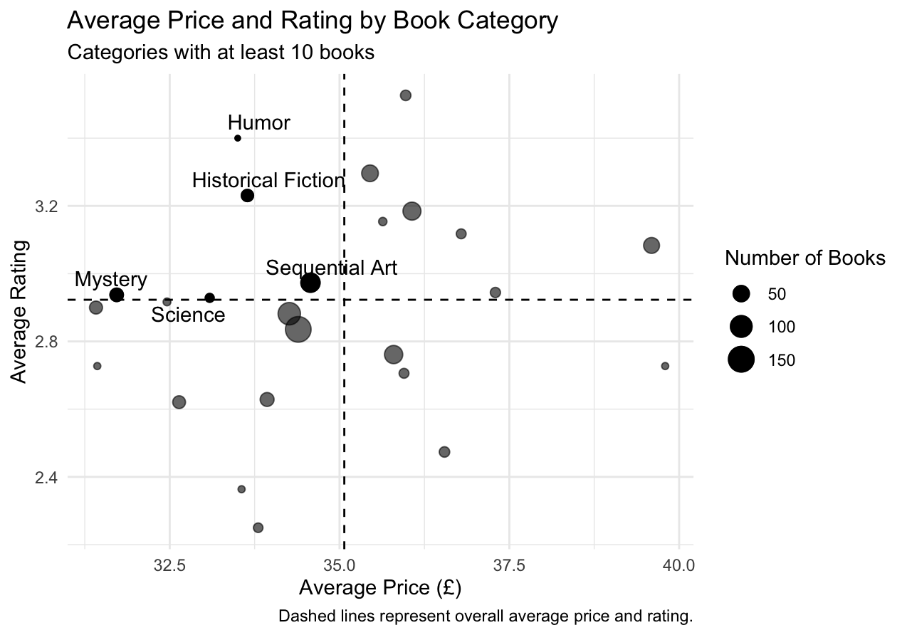

## Finding a Good Read Without Overspending

When choosing a book, price and reader ratings are often two useful pieces of information to consider. A highly rated book may seem appealing, but is it worth the price? On the other hand, the cheapest option may not necessarily provide the best reading experience.

This led me to a simple question:

> **Which book categories offer relatively highly rated books at lower prices?**

To explore this question, I used web scraping to collect book information and compared prices and ratings across different categories.

## Collecting the Data

For this analysis, I scraped data from [Books to Scrape](https://books.toscrape.com/), a website specifically designed for practicing web scraping.

Using the `rvest` package in R, I collected four pieces of information for each book:

- title
- category
- price
- star rating

Because the books are spread across multiple category pages, the scraping process also followed pagination links until all available books in each category were collected. I included short pauses between requests to avoid sending requests to the website too frequently.

After scraping the data, I converted prices from text into numeric values and transformed the star-rating labels into a numeric scale from 1 to 5.

## Comparing Book Categories

Since my research question focuses on categories rather than individual books, I summarized the data at the category level.

For each category, I calculated:

- the number of books
- average price
- median price
- average rating

One challenge was that category sizes varied substantially. Some categories contained only one or a few books, while the median category contained about 10 books. An average based on only one book could give a misleading impression of an entire category.

For the main comparison, I therefore focused on categories containing **at least 10 books**. This left 25 categories for analysis.

## What Counts as "Good Value"?

Rather than creating an arbitrary score such as rating divided by price, I used two simple benchmarks: the overall average book price and the overall average book rating.

I classified a category as meeting the **good-value criteria** when:

1. its average price was below the overall average book price, and
2. its average rating was above the overall average book rating.

This definition makes the tradeoff easy to interpret: I am looking for categories that are relatively less expensive while still receiving relatively stronger ratings.

## Price vs. Rating

The figure below compares average price and average rating across the 25 categories included in the analysis.

Each point represents one book category, and the size of the point reflects the number of books in that category. The vertical dashed line represents the overall average price, while the horizontal dashed line represents the overall average rating.

The area in the **upper-left** of the figure is especially interesting. Categories in this region have both lower-than-average prices and higher-than-average ratings, meaning they satisfy both of my good-value criteria.

## Which Categories Stand Out?

Five categories met both criteria:

| Category | Number of Books | Average Price (£) | Average Rating |
|---|---:|---:|---:|
| Humor | 10 | 33.5 | 3.40 |
| Historical Fiction | 26 | 33.6 | 3.23 |
| Sequential Art | 75 | 34.6 | 2.97 |
| Mystery | 32 | 31.7 | 2.94 |
| Science | 14 | 33.1 | 2.93 |

The results reveal several different ways a category can provide value.

**Humor** has the highest average rating among the five categories, at 3.40 stars, while still maintaining a below-average price.

**Historical Fiction** also combines a relatively strong average rating of 3.23 with a below-average price. With 26 books in the category, its result is also based on a larger selection than Humor.

**Mystery**, meanwhile, has the lowest average price among the five categories at approximately £31.70. For readers who place greater emphasis on price, it therefore represents a particularly affordable option among the categories meeting both criteria.

Sequential Art and Science also fall within the good-value region, although their average ratings are closer to the overall rating benchmark.

## What Should a Budget-Conscious Reader Do?

The analysis suggests that readers do not necessarily have to choose between lower prices and stronger ratings.

For readers who prioritize ratings, **Humor** may be worth exploring first because it has the highest average rating among the categories meeting the good-value criteria. **Historical Fiction** also offers a combination of relatively strong ratings and below-average prices across a larger number of books.

For readers who are particularly price-sensitive, **Mystery** may be worth exploring because it has the lowest average price among the five categories.

More broadly, the analysis shows why considering price and rating together can be more informative than simply searching for either the cheapest or the highest-rated category.

## Limitations

There are several limitations to keep in mind.

First, Books to Scrape is a website designed for web-scraping practice rather than a live bookstore. Therefore, the results should be interpreted as an illustration of how web-scraped data can support a purchasing decision rather than as current recommendations for the real book market.

Second, star ratings provide only a simple measure of book quality. They do not capture individual preferences, written reviews, popularity, or other factors that may influence whether a reader enjoys a book.

Finally, category sizes vary considerably. Although I limited the main analysis to categories with at least 10 books, averages can still be influenced by the composition and number of books within each category.

## Conclusion

By combining web scraping with a simple price-and-rating comparison, I identified five book categories that have both below-average prices and above-average ratings: **Humor, Historical Fiction, Sequential Art, Mystery, and Science**.

The results also show that "value" depends on what a reader cares about most. Humor stands out for its relatively high average rating, while Mystery stands out for its relatively low average price.

More importantly, this project demonstrates how information collected from the web can be transformed into a practical decision-making tool. Instead of looking at price or ratings separately, combining the two provides a clearer way to narrow down the available choices.