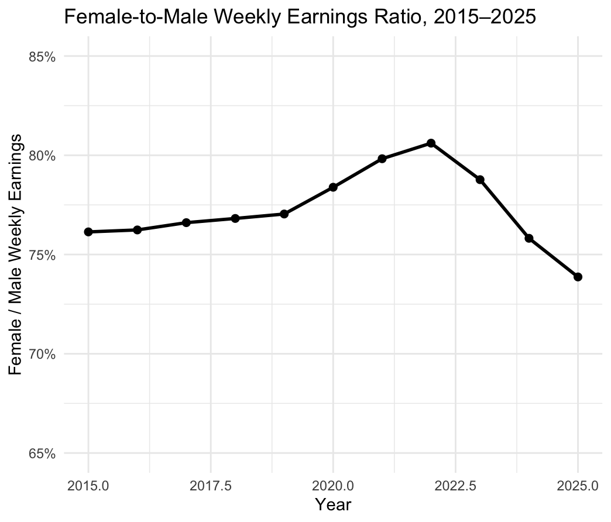
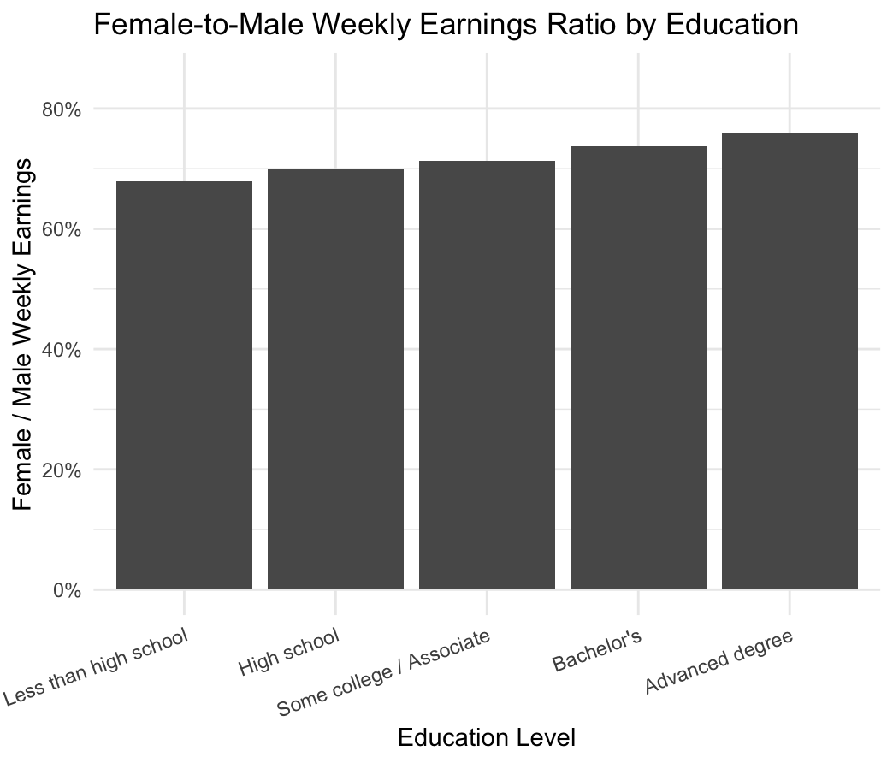
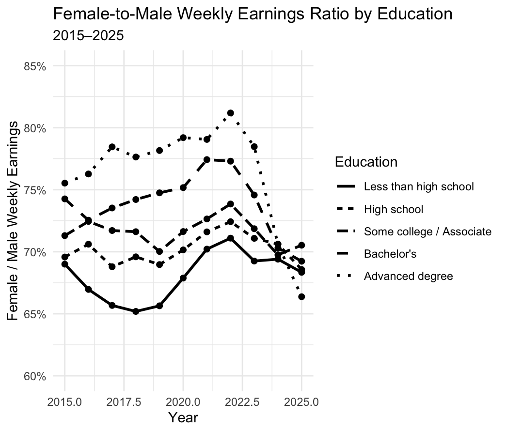

## Introduction

The gender wage gap is often summarized by a single number, but differences in earnings may vary across different groups of workers. Education is one important dimension to consider when examining these differences.

This led me to a simple question:

> **How does the gender wage gap vary across education levels in the United States?**

To explore this question, I used individual-level data from the Current Population Survey (CPS) through IPUMS. I focus on employed adults ages 25–64 from 2015 to 2025 and compare women's and men's weekly earnings across different education levels.

Rather than looking only at the overall gender wage gap, I examine how the female-to-male weekly earnings ratio changes over time and how it differs across education groups.

## Collecting and Preparing the Data

For this analysis, I used the Current Population Survey (CPS) provided through IPUMS.

The sample includes employed adults between ages 25 and 64 from 2015 through 2025. I use `EARNWEEK2` to measure weekly earnings and `EARNWT` as the earnings weight.

I restricted the sample to individuals with valid and positive weekly earnings and positive earnings weights. I also divided education into five groups:

- Less than high school
- High school
- Some college / Associate
- Bachelor's
- Advanced degree

Because CPS data are survey data, I used the earnings weights when calculating average weekly earnings. This allows the results to better represent the population rather than treating every survey observation as equally representative.

For each year and education group, I calculated the weighted average weekly earnings for men and women.

I then calculated the female-to-male weekly earnings ratio:

$$
\text{Female-to-Male Earnings Ratio}
=
\frac{\text{Female Mean Weekly Earnings}}
{\text{Male Mean Weekly Earnings}}
$$

For example, a ratio of 0.75 means that women's average weekly earnings are 75% of men's average weekly earnings.

## The Overall Gender Wage Gap Over Time

I first looked at the overall female-to-male weekly earnings ratio from 2015 to 2025.

The overall ratio was **76.1% in 2015**. It gradually increased during the following years and reached **80.6% in 2022**. After 2022, however, the ratio declined, reaching **73.9% in 2025**.

This means that the overall gender earnings gap did not move steadily in one direction during the period. Instead, the ratio improved during the earlier part of the sample before declining in the later years.

This pattern is useful as a starting point, but the overall ratio may hide differences between workers with different levels of education. I therefore next examine the gender earnings gap across education groups.

## How Does the Gender Wage Gap Differ Across Education Levels?

To examine differences across education groups, I calculated the weighted average weekly earnings for men and women within each education category and then calculated the female-to-male earnings ratio.

The results show differences across all five education groups.

The female-to-male weekly earnings ratios are approximately:

- **67.9%** for workers with less than a high school education
- **69.9%** for workers with a high school education
- **71.3%** for workers with some college or an associate degree
- **73.8%** for workers with a bachelor's degree
- **76.0%** for workers with an advanced degree

In this sample, the female-to-male earnings ratio is higher among workers with higher levels of education.

For example, women with an advanced degree earn about 76% as much as men with an advanced degree on average, compared with about 68% among workers with less than a high school education.

This suggests that education is an important dimension to consider when examining the gender earnings gap. Looking only at an overall average would hide these differences across education groups.

However, this analysis is descriptive. The results do not show that obtaining more education causes the gender earnings gap to become smaller. Education may also be associated with other factors such as occupation, industry, work experience, and hours worked.

## How Do Education-Specific Gaps Change Over Time?

The previous comparison combines data from 2015 through 2025. To examine whether the differences across education groups are stable over time, I calculated the female-to-male earnings ratio separately for each education group and each year.

Figure 3 shows how the female-to-male earnings ratio changes over time for each education group.

The lines allow us to compare both differences between education groups and changes within each group over time. The education-specific ratios fluctuate from year to year, and the lines sometimes cross each other. This means that the relationship between education level and the gender earnings gap is not constant over the entire sample period.

One particularly noticeable pattern is the decline in the advanced-degree ratio after 2022. The ratio reaches about 81% in 2022 but falls to about 67% by 2025.

This highlights why it is useful to examine the data from multiple perspectives. Figure 1 shows the overall trend, Figure 2 shows differences across education levels, and Figure 3 combines both dimensions.

Together, the three figures provide a more detailed picture of the gender earnings gap than a single overall statistic would provide.

## What Can We Learn from the Data?

The analysis reveals three main patterns.

First, the overall female-to-male weekly earnings ratio changed substantially over the 2015–2025 period. It increased from 76.1% in 2015 to 80.6% in 2022 before falling to 73.9% in 2025.

Second, the gender earnings gap varies across education levels. Over the full sample period, the female-to-male earnings ratio ranges from approximately 67.9% among workers with less than a high school education to 76.0% among workers with an advanced degree.

Third, education-specific earnings ratios also vary over time. Therefore, the gender earnings gap is not a single fixed number that applies equally to all workers.

These results show the value of breaking down labor-market data by characteristics such as education. An overall average can provide a useful summary, but it may conceal meaningful differences between groups.

## Limitations

There are several limitations to this analysis.

First, the analysis is **descriptive rather than causal**. The results show an association between education level and the female-to-male earnings ratio, but they do not establish that education itself causes differences in the gender earnings gap.

Second, the outcome variable is **weekly earnings rather than hourly wages**. Weekly earnings can be affected by the number of hours worked, so differences in hours may contribute to the observed gender earnings gap.

Third, workers within the same education group can still differ in many other characteristics, including occupation, industry, age, and work experience. These factors are not controlled for in this descriptive analysis.

Finally, the earnings data are nominal. The female-to-male ratio within each year is not directly affected by common inflation, but changes in nominal earnings levels over time should not be interpreted as changes in real purchasing power.

## Conclusion

Using CPS microdata from 2015 to 2025, I examined how the gender gap in weekly earnings varies across education levels and over time.

The overall female-to-male weekly earnings ratio increased from **76.1% in 2015 to 80.6% in 2022**, before declining to **73.9% in 2025**. Across education groups, the ratio ranged from **67.9% among workers with less than a high school education to 76.0% among workers with an advanced degree**.

The results suggest that the gender earnings gap is not uniform across the labor market. Education level provides one useful way to uncover differences that are not visible in the overall average.

More broadly, this project demonstrates how individual-level survey data can be transformed into clear visualizations that help answer an economic question. By combining trends over time with differences across education groups, we can obtain a more detailed understanding of the gender earnings gap in the United States.