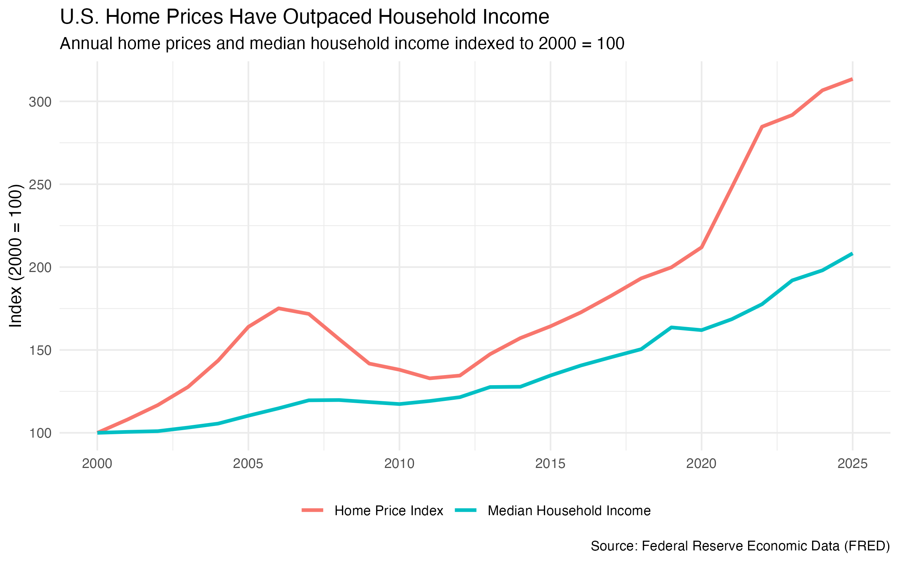
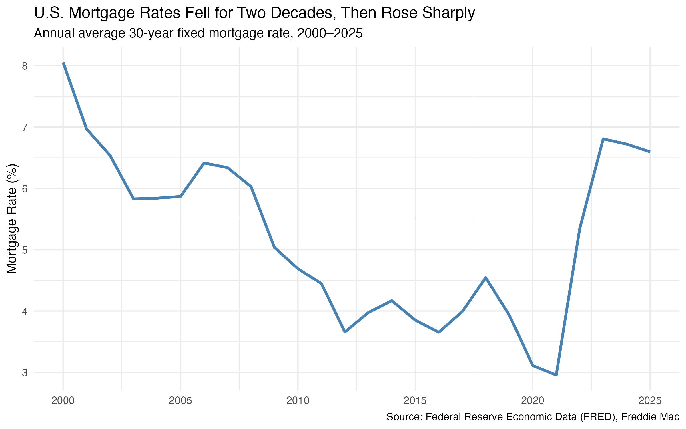
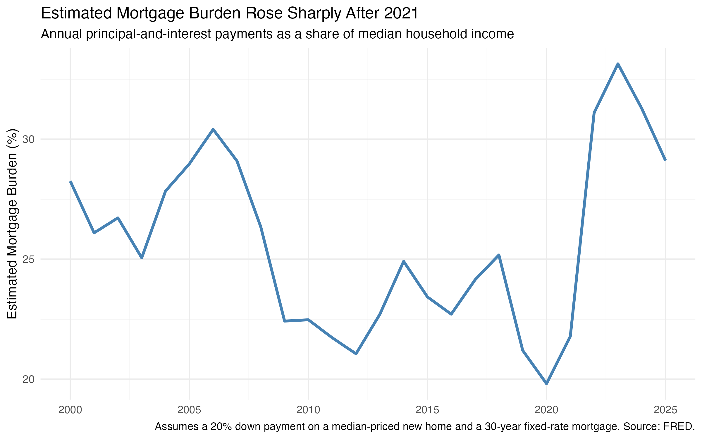

## Introduction

Buying a home is one of the largest financial decisions many households make. But whether a home is affordable depends on more than its price. Household income determines how much a family can reasonably spend, while mortgage rates determine the cost of borrowing. A home can therefore become harder to afford even if its price is no longer rising, especially when interest rates increase.

This raises the question:

**How has housing affordability in the United States changed as home prices, mortgage rates, and household incomes have evolved since 2000?**

To explore this question, I use U.S. housing, mortgage, and income data from Federal Reserve Economic Data (FRED) covering 2000 through 2025. I focus on three parts of the affordability story. First, I compare the growth of home prices with household income. Second, I examine changes in mortgage rates. Finally, I combine home prices, borrowing costs, and income into a simplified measure of mortgage burden.

Together, these three perspectives show that housing affordability cannot be understood from home prices alone.

## Data and Method

I collected four series programmatically from FRED using the `fredr` package in R:

- the S&P Cotality Case-Shiller U.S. National Home Price Index (`CSUSHPINSA`);
- the 30-Year Fixed Rate Mortgage Average in the United States (`MORTGAGE30US`);
- Median Household Income in the United States (`MEHOINUSA646N`); and
- the Median Sales Price of New Houses Sold for the United States (`MSPUS`).

These series are reported at different frequencies. The home price index is monthly, mortgage rates are weekly, median new-home sale prices are quarterly, and household income is annual. To make the series comparable, I converted them to annual observations. I calculated annual averages for the home price index, mortgage rate, and median new-home sale price, while household income was already available annually.

For the first comparison, I reindexed both home prices and household income so that their annual values in 2000 equal 100. This allows the two series to be compared in terms of relative growth even though they are originally measured in different units.

## Home Prices Have Outpaced Household Income

The first part of the affordability story is the relationship between home prices and household income.

{fig-alt="Line chart comparing the U.S. home price index and median household income, both indexed to 2000 equals 100, from 2000 to 2025." width=100%}

Both series begin at 100 in 2000, but they follow increasingly different paths over the next 25 years.

Home prices increased rapidly during the early 2000s, reaching an indexed value of roughly 176 in 2006 before declining during and after the housing market downturn. Household income grew much more gradually over the same period.

The gap became especially pronounced after 2020. By 2025, the home price index had reached approximately **314**, compared with about **208** for median household income.

In other words, relative to their 2000 levels, home prices more than tripled while nominal median household income roughly doubled. The comparison suggests that the price of housing has increased substantially faster than the income available to purchase it.

However, this price-income gap does not provide a complete measure of affordability. Most buyers finance at least part of a home purchase with a mortgage. As a result, the interest rate attached to that mortgage can substantially change the monthly cost of purchasing the same home.

## Falling Mortgage Rates Initially Helped Buyers

The second figure adds the cost of borrowing to the story.

{fig-alt="Line chart showing the annual average U.S. 30-year fixed mortgage rate from 2000 to 2025." width=100%}

Mortgage rates generally declined over the first two decades of the period. The annual average 30-year fixed mortgage rate was approximately **8.05% in 2000**. By 2010, it had fallen to about **4.69%**, and it reached approximately **2.96% in 2021**.

This decline matters for affordability because a lower interest rate reduces the monthly principal-and-interest payment associated with a given mortgage balance. In other words, falling rates helped offset some of the affordability pressure created by rising home prices.

The situation changed dramatically after 2021.

The annual average mortgage rate increased from **2.96% in 2021** to **5.34% in 2022**, and then to **6.81% in 2023**. Rates remained relatively high afterward, averaging about **6.72% in 2024** and **6.60% in 2025**.

This sharp increase shows why looking only at home prices can be misleading. Even if the price of a home stays constant, financing that home becomes substantially more expensive when mortgage rates rise.

The next step is therefore to combine these factors rather than examine them separately.

## Combining Home Prices, Mortgage Rates, and Income

To capture the interaction between prices, interest rates, and income, I constructed a simplified measure of **estimated mortgage burden**.

For each year, I assume that a household purchases a median-priced new home with a **20% down payment** and finances the remaining 80% with a **30-year fixed-rate mortgage**. I use the annual average mortgage rate to calculate the monthly principal-and-interest payment.

I then calculate:

$$
\text{Estimated Mortgage Burden}
=
\frac{\text{Annual Principal-and-Interest Payment}}
{\text{Median Household Income}}
\times 100
$$

A higher value means that the estimated mortgage payment would consume a larger share of median household income and therefore indicates lower affordability under these standardized assumptions.

{fig-alt="Line chart showing estimated annual mortgage principal-and-interest payments as a percentage of median household income from 2000 to 2025." width=100%}

This figure reveals a pattern that is not obvious from home prices alone.

In 2000, estimated mortgage burden was approximately **28.3%** of median household income. It increased to about **30.4% in 2006**, around the peak of the pre-financial-crisis housing boom.

Afterward, the estimated burden generally declined. By 2012, it had fallen to approximately **21.1%**, and in 2020 it reached its lowest value in the sample at about **19.8%**.

This is particularly interesting because homes in 2020 were much more expensive than they had been in 2000. The first figure shows that the home price index had already risen to roughly twice its 2000 level. Yet estimated mortgage burden was lower than in 2000.

The mortgage-rate figure helps explain why. By 2020, the annual average 30-year mortgage rate had fallen to only about **3.11%**. Low borrowing costs partially offset the effect of higher home prices.

## The Affordability Shock After 2021

The clearest change occurs between 2021 and 2023.

Estimated mortgage burden increased from **21.8% in 2021** to **31.1% in 2022** and then reached **33.1% in 2023**, the highest value in the 2000–2025 period.

That is an increase of approximately **11.3 percentage points in just two years**.

The timing is important. Home prices had already risen sharply by 2021, but mortgage rates were still historically low. Once mortgage rates increased in 2022 and 2023, buyers faced both elevated home prices and much higher financing costs at the same time.

For example, the annual average median new-home sale price was approximately **$383,000 in 2021**, with an average mortgage rate of **2.96%**. Under the standardized assumptions used here, the estimated monthly principal-and-interest payment was about **$1,285**.

In 2023, the annual average median new-home sale price was approximately **$426,525** and the average mortgage rate had increased to **6.81%**. The estimated monthly payment rose to approximately **$2,226**.

This means that the standardized monthly mortgage payment increased by roughly **$941**, or about **73%**, between 2021 and 2023.

Household income increased over the same period, but not enough to offset the combined effect of higher home prices and substantially higher interest rates. As a result, the estimated mortgage burden rose sharply.

## Lower Home Prices Do Not Necessarily Mean Affordable Homes

The final years of the data provide another useful example.

The annual average of quarterly median new-home sale prices declined from approximately **$432,950 in 2022** to **$415,400 in 2025**. At the same time, median household income continued to increase.

These changes helped reduce estimated mortgage burden from its 2023 peak of 33.1% to **29.1% in 2025**.

However, the burden remained considerably higher than the **19.8% recorded in 2020** and the **21.8% recorded in 2021**.

The reason is that mortgage rates remained elevated. The average rate in 2025 was approximately **6.60%**, more than twice the 2021 average of 2.96%.

This illustrates an important economic point: **a decline in home prices does not automatically restore housing affordability**. When borrowing costs remain high, buyers may still face large monthly payments even if home prices have fallen from their peak.

## What Do the Three Figures Tell Us?

Taken together, the three visualizations tell a consistent story.

First, **home prices have grown substantially faster than median household income since 2000**. By 2025, the home price index stood at roughly 314 relative to its 2000 level, compared with about 208 for household income.

Second, **falling mortgage rates helped offset some of this growing price-income gap for much of the 2000s and 2010s**. This helps explain why the estimated mortgage burden could decline even while home prices were increasing.

Third, **the sharp rise in mortgage rates after 2021 removed much of that offset**. Potential buyers were suddenly facing the combination of elevated home prices and much more expensive borrowing. The result was a rapid increase in estimated mortgage burden, which peaked at 33.1% in 2023.

The analysis therefore suggests that housing affordability is best understood as the interaction of three factors:

**home prices + borrowing costs + household income.**

Looking at any one of these variables in isolation can miss an important part of the story.

## Limitations

The estimated mortgage burden used in this analysis is a standardized measure rather than an official housing affordability index.

Several assumptions are necessary to make the comparison consistent over time. The calculation assumes a 20% down payment and a 30-year fixed-rate mortgage. It also assumes that the buyer purchases a median-priced new home and receives the annual average mortgage rate.

The calculation includes only mortgage principal and interest. It does not include property taxes, homeowners insurance, HOA fees, maintenance costs, closing costs, or other expenses associated with homeownership. Actual mortgage rates and down payments also vary across borrowers depending on factors such as credit history and financial circumstances.

In addition, the dollar home-price series used in the mortgage calculation represents the median sales price of **new houses sold**, rather than all existing and new homes in the United States.

Finally, the household income series is measured in current dollars. The indexed comparison in the first figure therefore shows the relative growth of nominal household income and the home price index; it should not be interpreted as a measure of real income growth.

Despite these limitations, applying the same assumptions in every year provides a useful standardized comparison of how the financial conditions facing a hypothetical homebuyer have changed over time.

## Conclusion

Housing affordability in the United States has changed substantially since 2000, but the story is more complicated than simply saying that home prices increased.

Home prices grew much faster than median household income, creating increasing pressure on affordability. For many years, however, declining mortgage rates partially offset that pressure by making it cheaper to finance a home. That changed after 2021, when mortgage rates rose rapidly while home prices remained elevated.

Under the standardized assumptions used in this analysis, estimated mortgage burden increased from **21.8% of median household income in 2021 to 33.1% in 2023**. Although the burden declined to **29.1% by 2025**, it remained substantially above the levels observed during the low-rate years.

The main takeaway is that **housing affordability cannot be evaluated from home prices alone**. What ultimately matters for a financed home purchase is not only the price of the house, but also the interest rate used to finance it and the income available to make the payments.